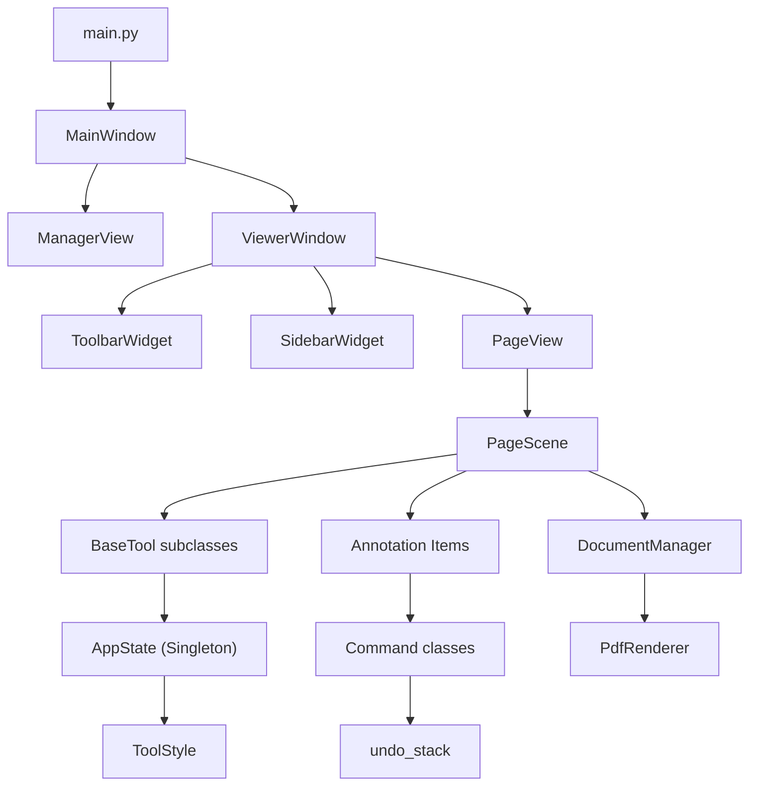

# PDF Annotator — Architecture

Professional desktop PDF annotation tool built with **Python 3.12+** and **PySide6** (Qt 6).

## Package Structure

```
pdf_annotator/
├── main.py                  # Entry point: creates QApplication + MainWindow
├── app/                     # Application state
│   └── app_state.py         # Singleton AppState (current tool, style, page, zoom)
├── core/                    # Domain logic (no Qt widgets)
│   ├── app_settings.py      # App configuration and preferences
│   ├── document_manager.py  # PDF loading via PyMuPDF (fitz)
│   ├── freenotes_store.py   # State persistence for internal data
│   ├── library_manager.py   # File system scanning and library management
│   ├── pdf_exporter.py      # Main orchestrator for PDF export
│   ├── pdf_text_exporter.py # Renders TextBoxItems to PDF
│   ├── pdf_shape_exporter.py# Renders ShapeItems to PDF
│   ├── pdf_path_exporter.py # Renders Strokes & Highlights to PDF
│   ├── pdf_renderer.py      # Page → QPixmap rendering with DPI scaling
│   ├── shape_style.py       # Styling classes for geometric shapes
│   ├── tool_style.py        # ToolStyle dataclass (color, width, font, etc.)
│   ├── undo_stack.py        # Global undo stack (thin wrapper around list)
│   └── zip_exporter.py      # Exporting projects as ZIP archives
├── items/                   # QGraphicsItem subclasses (annotations on canvas)
│   ├── text_box_item.py     # TextBoxItem — rich-text annotation (uses mixins below)
│   ├── text_box_formatting.py  # TextBoxFormattingMixin — bold/italic/font/color
│   ├── text_box_pseudo_lists.py  # TextBoxPseudoListMixin — simulated list creation/toggling
│   ├── text_box_input.py       # TextBoxInputMixin — keyboard & mouse events
│   ├── stroke_item.py       # StrokeItem — freehand pen strokes
│   ├── highlight_item.py    # HighlightItem — rectangular highlighter
│   ├── shape_item.py        # ShapeItem — geometry (rect, ellipse, line, arrow)
│   ├── shape_handles.py     # Specialized handles for shapes
│   ├── handle_item.py       # ResizeHandleItem + HandlePosition enum
│   ├── move_handle_item.py  # MoveHandleItem (top-center drag pill)
│   ├── rotate_handle_item.py # RotateHandleItem (bottom-center)
│   ├── options_handle_item.py # OptionsHandleItem (Copy/Cut/Delete bar)
│   ├── bounding_box_handle_manager.py  # Multi-selection bounding box
│   ├── selection_overlay_item.py       # Visual selection overlay
│   └── eraser_cursor_item.py          # Eraser visual feedback
├── tools/                   # Tool implementations (Strategy pattern)
│   ├── base_tool.py         # BaseTool ABC (on_press, on_move, on_release)
│   ├── hand_tool.py         # Pan/scroll
│   ├── pen_tool.py          # Freehand drawing
│   ├── highlighter_tool.py  # Rectangular highlighting
│   ├── eraser_tool.py       # Stroke/highlight erasing
│   ├── text_tool.py         # TextBox creation & editing
│   ├── shape_tool.py        # Geometric shape creation
│   └── selection_tool.py    # Multi-select, move, resize, clipboard
├── commands/                # Undo/Redo commands (Command pattern)
│   ├── add_item_command.py, remove_item_command.py
│   ├── add_textbox_command.py, remove_textbox_command.py
│   ├── edit_text_command.py, format_text_command.py
│   ├── move_items_command.py, move_textbox_command.py
│   ├── resize_textbox_command.py, resize_stroke_command.py
│   ├── resize_highlight_command.py
│   ├── rotate_textbox_command.py
│   ├── cut_textbox_command.py, delete_items_command.py
│   ├── paste_items_command.py
│   └── delete_page_command.py  # Deleting single pages
│   ├── font_size_widget.py  # FontSizeWidget — compact number input with arrows
│   ├── color_picker_popup.py # Color picker dialog
│   ├── color_wheel_widget.py # HSV color wheel
│   ├── textbox_options_popup.py # Right-click options for textboxes
│   ├── three_dot_menu.py    # General context menu component
│   └── icon_factory.py      # SVG icon generation (Lucide-style)
├── utils/                   # General utility functions
│   └── path_helpers.py      # Cross-platform path resolution
└── styles/                  # QSS stylesheets
    ├── base.qss, toolbar.qss, formatting_bar.qss
    ├── dark_theme.qss, textbox.qss
    └── loader.py            # QSS file loader utility
```

## Architecture Diagram



## Design Patterns

### 1. Singleton — `AppState`
Global application state: active tool name, tool style, current page/zoom, clipboard. All components read/write through `AppState()`. Changes emit Qt Signals (`tool_changed`, `style_changed`, `page_changed`, `zoom_changed`).

### 2. Command Pattern — `commands/`
Every user action that modifies annotations is wrapped in a command class with `redo()` and `undo()` methods. Commands are pushed to `core.undo_stack`. Each command stores the minimal before/after state (e.g., old/new HTML for text edits).

### 3. Strategy Pattern — `tools/`
`PageScene` holds one active `BaseTool` subclass. Mouse/key events are delegated to the tool via `on_press()`, `on_move()`, `on_release()`. Tools read style from `AppState.tool_style`.

### 4. Mixin Pattern
Pure-Python mixins break down large classes while preserving their public API. Mixins must **not** inherit from `QObject`.

| Class | Mixins | Qt Base |
|-------|--------|---------|
| `TextBoxItem` | `TextBoxInputMixin`, `TextBoxFormattingMixin`, `TextBoxPseudoListMixin` | `QGraphicsObject` |
| `PageScene` | `SceneRegistryMixin`, `SceneClipboardMixin`, `SceneSelectionMixin`, `ScenePageManagerMixin` | `QGraphicsScene` |
| `ToolbarWidget` | `ToolbarModePopupsMixin` | `QWidget` |
| `ViewerWindow` | `ViewerFileIOMixin`, `ViewerToolManagerMixin` | `QWidget` |

**MRO note:** Mixins come before the Qt base class so their overrides take precedence. Mixins access host attributes (e.g. `self._cursor`, `self._selected_items`) without defining them — they are set in `__init__`.

## Conventions

| Area | Convention |
|------|-----------|
| **Language** | UI strings in German, code/comments in English |
| **Imports** | Use `TYPE_CHECKING` for circular deps; local imports in methods when needed |
| **Signals** | Defined as class-level `Signal()` on `QObject`/`QGraphicsObject` subclasses |
| **File size** | Target ≤300 lines per file; use mixins or decomposition if exceeding |
| **Naming** | `snake_case` for files/methods, `PascalCase` for classes, `UPPER_CASE` for constants |
| **Coordinates** | Items use local coords (`setPos(topLeft)`, `_rect = QRectF(0, 0, w, h)`); `get_rect()` returns scene coords |
| **Z-values** | PDF pages: 0, Strokes: 10, Highlights: 5, TextBoxes: 15, Eraser cursor: 20 |
| **Undo** | Text edits use checkpoint-based undo (`_mark_undo_pending` → `_commit_undo_checkpoint`); formatting uses immediate `FormatTextCommand` |

## Known Workarounds

- **PyQt/PySide6 MRO:** Pure Python mixins must not inherit from `QObject`. Only the final class (`TextBoxItem`) inherits `QGraphicsObject`.
- **Circular imports:** `PageScene ↔ TextBoxItem` — resolved via `TYPE_CHECKING` + local imports.
- **Handle visibility:** `hasattr()` checks in `_update_handle_positions()` guard against access before handle creation in `__init__`.
- **No test suite:** Verification is manual (run `python main.py`, test tool interactions).
